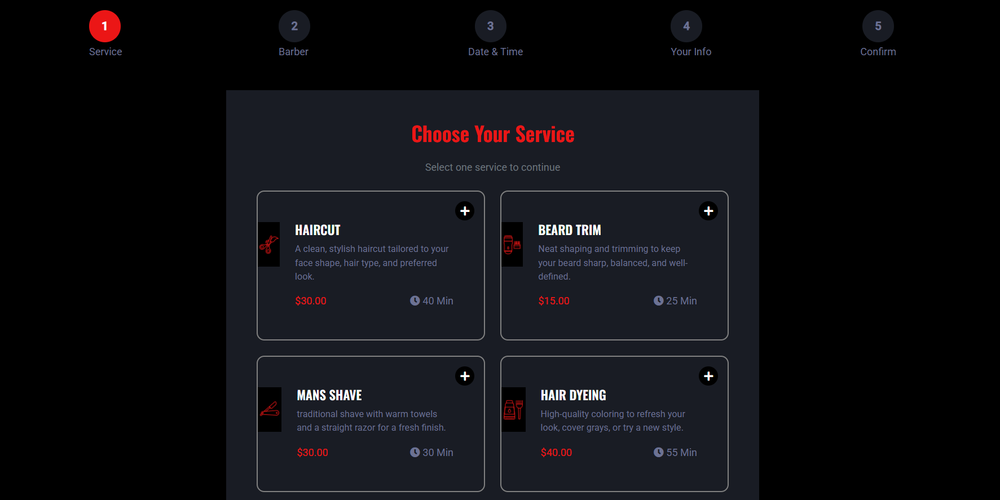

# 💈 Barbershop Booking System

A modern web application for managing barbershop appointments, client bookings, and administrative tasks. Built with React frontend and Laravel backend.

## 📸 Screenshots
**Home Page**


**Appointment Booking**


**Admin Dashboard**


## 🛠️ Tech Stack
- **Frontend:** React, HTML5, CSS3, JavaScript
- **Backend:** Laravel (PHP 8.x)
- **Database:** MySQL
- **API:** RESTful API with Laravel

## ✨ Features
- Online appointment scheduling with calendar
- Barber profiles and selection
- Admin dashboard for managing appointments
- Customer database management
- Responsive mobile-friendly design
- User authentication (if implemented)

## 📂 Repository
- **GitHub:** [github.com/Cocona09/barber_app](https://github.com/Cocona09/barber_app)

## 🏗️ Setup Instructions

### Prerequisites
- PHP 8.0+ with Composer
- Node.js 16+ with npm
- MySQL 5.7+
- Git

### Installation Steps

#### 1. Clone Repository
```bash
git clone https://github.com/Cocona09/barber_app.git
cd barber_app
